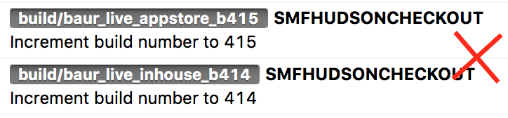
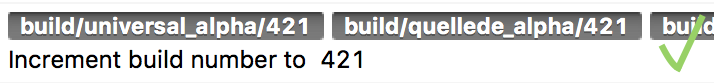

# SMF iOS Fastlane Commons - Release Notes v0.1.0

## Breaking changes

### #1 The commit and push of generated code is now a opt-in setting
The commit and push of generated code is now a opt-in setting to prevent unnecessary commits from R.swift which only contain a changed bundle identifier. The setting `push_generated_code` should be set to `true` in the *BuildVariants.json* if there is code which should be pushed. This **is** eg. the case for PhraseApp projects!

## Improvements

### #1 Build number is incremented only if code changed
The build number won't be incremented with each build anymore. The goal is now to only increment it if code or the project configuration changed.

Technically this is achieved by checking if the former commit was a build number incrementation from Jenkins. In case the last commit was a build number incrementation from Jenkins the build number **won't** be incremented.

The following side case will lead to a build number incrementation in any case:

- the build variant of the former build is the same as the current one
- `push_generated_code` is set to `true` and there was generated code modified during the build process. This will be the case in PhraseApp projects

###### Example: Old build number incrementation with each builds

###### Example: New build number incrementation only if the last commit wasn't a build number incrementation from Jenkins

### #2 Clean up after a failed app deploy job
The following changes are made to let the repo and HockeyApp etc. in a cleaner state after failed build jobs:

- code changes during the build projects are now only committed, the push to GitHub is performed as last step
- the uploaded HockeyApp entry will be removed - if possible - after a build job failed. **Note:** This requires that the projects Fastfile calls the `smf_handle_exception` lane. There is a modification needed in most projects as the current implementation won't catch most of the errors.

### #3 Clean up after a failed Pod publish job
The following changes are made to let the repo etc. in a cleaner state after failed build jobs:

- code changes during the build projects are now committed and pushed to a temporary branch, the push to the original branch is performed as last step

### #4 Improved notifications to HipChat and via Mail

- the branch is added to the title of all notifications which already contain the Pod version or build number
- error messages to HipChat contain now the error instead of the release notes.
- the error message type is marked as `success` is `false` which changes the style inside of HipChat
- the usage of emojis is reduced ;)

### #5 Tags are now fully separated by "/"
Tags are now separated by "/". This is useful for apps like SourceTree which group the segments between a slash into subfolders.

A typical tag is now `build/hidrive_alpha/124` instead of `build/hidrive_alpha_b124`

### #6 GitHub release are now created for all builds
The release notes will now be added to the GitHub release for all build variants. This was already the case for Pod frameworks.

### #7 MetaJSON is now created per default for all build variants

