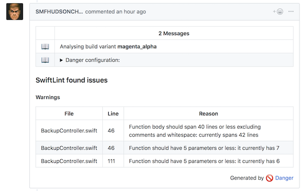
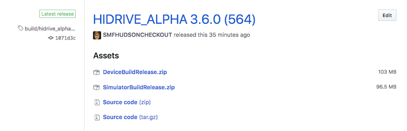

# SMF iOS Fastlane Commons - Release Notes v0.2.0

## New Features

### #1 Danger

All Pull Requests will be analysed with [Danger](http://danger.systems) per default now!


###### Example: Danger report in the Strato macOS App


The following checks are performed and displayed in the pull request by default:

- Xcode warnings and errors
- GitHub PR length
- Code Coverage for modified files
- Total Code Coverage
- SwiftLint warnings for modified files

All checks can be disabled and modified in the configuration json:

```json
...

"danger_config": {
  "xcode_build_warnings.use_feature": false,
}

...
```

The following default values are used otherwise:

```json
{
      "xcode_build_warnings.use_feature": true,
      "github.pr.big_length.use_feature": true,
      "github.pr.big_length.lines_of_code": 10000,
      "code_coverage.slather.use_feature": true,
      "code_coverage.slather.notify_if_coverage_is_less_than": 0,
      "code_coverage.slather.notify_if_modified_file_is_less_than": 0,
      "code_coverage.slather.notify_level": "fail",
      "swiftlint.use_feature": true,
      "swiftlint.fail_on_error": true
}
```

If Danger shouldn't be performed, the file `Dangerfile` has to be removed from the project.

##### Known issues

- Code Coverage doesn't reflect the real coverage for framework projects

### #2 Xcode warnings, SwiftLint reports and Code Coverage is stored in MetaJSON

Xcode warnings, SwiftLint reports and Code Coverage is stored in MetaJSON once the app is deployed. These information is not yet used but might be added to status boards and Confluence later.

##### Known issues

- Code Coverage doesn't reflect the real coverage for framework projects

### #3 Better notifications - especially for builds with multiple build variants in a row and iTunes Connect uploads

HipChat and mail notifications are now send directly after some events happened and not at the end of the build job. See Breaking changes #1 for more details.

### #4 Device and Simulator builds can be attached to GitHub release to enable separated UI-Tests

Device and Simulator builds can be attached to GitHub releases to be used for UI-Tests later.

###### Example: GitHub release with attached build outputs


You need to enable this feature in the configuration json:

```json
...

"build_variants": {
	"hidrive_alpha": {
    	...
		"attach_build_outputs_to_github"	: true
	},
	
...
```

### #5 Added some custom prechecks before building apps for iTunes Connect

Build jobs will now directly be aborted before even building the app if the projects marketing version is not existing and editable in iTunes Connect.
This prevents errors after the app is uploaded like: The app version is already in sale.


## Breaking changes

### #1 Success and error messages are now handled by the Fastlane Commons code

Instead of sending error or success notifications once in the end of the build jobs, Fastlane Commons sends them now directly after certain events happen during the build job. This enables eg. build jobs which build multiple build variants in a row. After each build variants was build a notification is send, not only one once the build job has completed.

The notifications have to enabled in lanes if they are wanted before calling the real logic:

```ruby
smf_set_should_send_deploy_notifications(true)

```

### #2 The complete Fastlane Commons repo is downloaded temporarily during the build process

Until now it was only possible to download Fastlane Action files and one Fastfile during the build process. This blocked us to move more code and files into the Fastlane Commons repo. With this release the complete Fastlane Commons repo is downloaded temporarily into the project which enables us to split the Fastlane code into multiple files and also use other default files like a Gemfile or Dangerfile.

The projects need to declare the Fastlane commons branch (`fastlane_commons_branch`) which should be used in the configurations JSON:

```json
...

"project": {
	"project_name"				: "SelfieStar",
	"hipchat_channel"			: "Selfie iOS",
	"fastlane_commons_branch"	: "master"
},

...
```

Also the download of the Commons repo has to be triggered in the projects Fastfile:

```ruby
config = JSON.parse(File.read('Config.json'))

before_all do
  # Import the Fastlane Commons Repo
  fastlane_commons_branch = config["project"]["fastlane_commons_branch"]
  import_from_git(url: "git@github.com:smartmobilefactory/SMF-iOS-Fastlane-Commons.git", branch: fastlane_commons_branch)
end
```

### #3 In order to run Danger during PR checks a minimum commit of SMF-iOS-CommonProjectSetupFiles is needed

As SwiftLint was disabled for release builds before, at least the commit `b1b13b17655b91e25c7a06ba0d25751efb5a7fdd` of SMF-iOS-CommonProjectSetupFiles is needed if Danger is used (which is done by default).

### #4 Gemfile and Dangerfile are required

Danger requires the usage of a Gemfile and Dangerfile. They only need to contain code which refers to the shared Gemfile and Dangerfile which is contained in the Fastlane commons repo.

**Dangerfile**

```ruby
# Import the Dangerfile of the SMF-iOS-Fastlane commons repo
fastlane_commmons_folder = ENV['FASTLANE_COMMONS_FOLDER']
danger.import_dangerfile(path: "#{fastlane_commmons_folder}/danger")

# Add custom logic here
```

**Gemfile**

```ruby
source "https://rubygems.org"

gem 'fastlane'
gem 'cocoapods'

gemfile_local = './.fastlane-smf-commons/danger/Gemfile'

if File.readable?(gemfile_local)
  instance_eval(File.read(gemfile_local))
end
```

### #5 The configuration json is used instead of lane parameters if possible

Allmost all lane parameters are replaced by direct configuration json access deep inside the Fastlane Commons code. This is needed in some parts eg. for Danger where no direct access to the Fastlane Ruby code is given. It results in a more streamlined and clear configuration usage with one source of truth: the configuration json. Also the introduction of new features will require less changes in a project as all Fastlane Commons code has access to the configuration.

#### a) The path to the Fastlane configuration has to be provided

The projects Fastfile has to provide a lane which returns the path to the configuration json (formerly BuildVariants.json).

```ruby
private_lane :fastlane_config_path do
  # Return the path to the Fastlane config file
  "#{Dir.pwd}/Config.json"
end
```

#### b) The build variant, git branch and notification setting has to be set before logic can be called

At least the build variant has to be set before any logic can be called. 

```ruby
lane :check_pr do
    
  smf_set_build_variant("alpha")

  # Now we can call the real logic - without providing any other configuration
  smf_check_pr
end
```

When deploying apps or publishing pods also the notification setting and git branch has to be set.

```ruby
lane :deploy_app do |options|

  smf_set_should_send_deploy_notifications(true)

  smf_set_git_branch(options[:branch])
  smf_set_build_variant(options[:build_variant])
    
  # Now we can call the real logic - without providing any other configuration
  smf_deploy_app
end
```

## Improvements

Many small bug fixes

